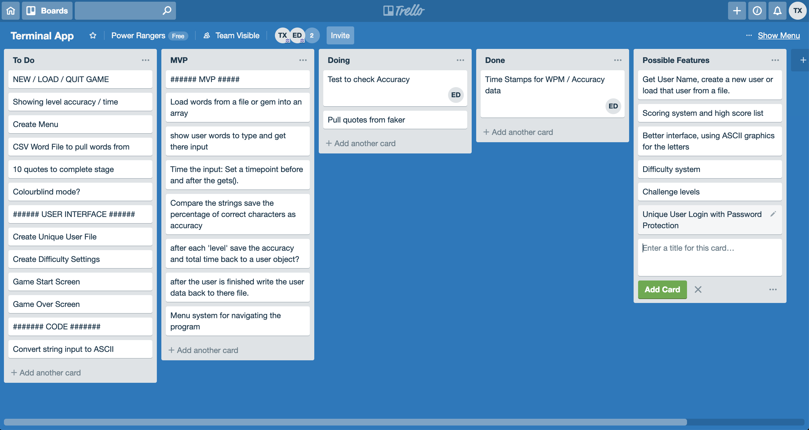
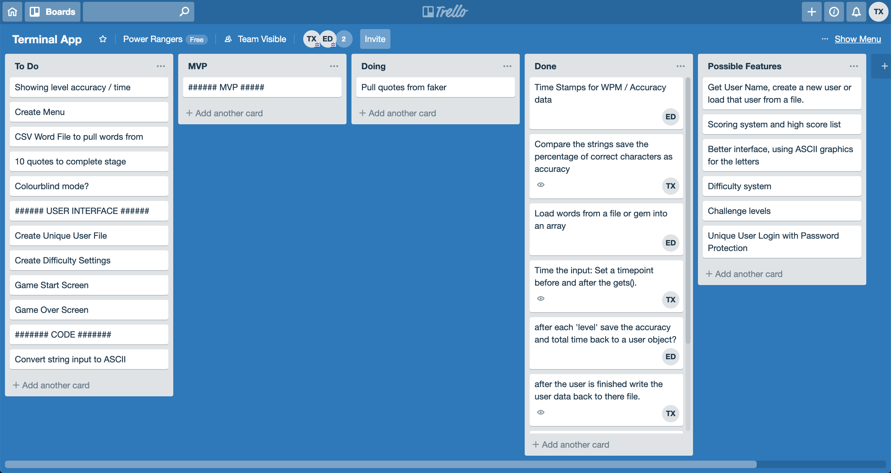
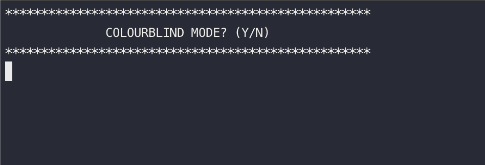
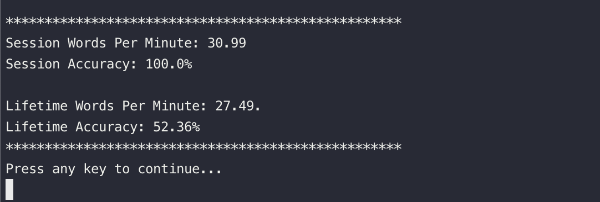

# Keyboard Warrior 

Keyboard Warrior is a terminal game created in ruby whereby the user types in randomly generated greek philosopher quote.

## Contents
* [Build Process](#Build-Process)
* [Planning](#Plan)
* [Structure](#Structure)
* [Features](#Features)
* [Technical](#Technical)
* [Setup](#setup)
* [Interface](#Interface)
* [Authors](#Authors)
* [Master Repository](#Master-Repository)

# Build process
Our primary aim was to create a program that would test the users typing speed and accuracy testing them on  randomly generated quotes. It would check the original quote against the one that the user wrote and return an accuracy percentage and a total words per minute.
Our secondary goal was to save the users statistics between sessions.

# Planning






# Structure
The program's functionality was split into 3 Classes, Game, Input and User. This allowed us to abstract some of the complexity of the functions away, making the code more readable. It has the added benefit of encapsulating variables that were only used in specific functions (eg. only storing the file path in the User class).
The classes were put in separate files to enhance the readability of the code. The Input class pulls the data from 'faker' and saves it to an array that the Game class can use.  The Game class is used to call the methods that make up the main functionality, displaying the quotes and getting user input. The User class holds data related to the long term statistics of the user, to load and save this data between sessions.
Apart from the main application loop, almost all of the functionality was put into methods. This allowed us to repeat certain sections of code over again, this part was particularly useful for the accuracy compare function. This function was broken into two parts, one to check each word and one part (letter_accuracy), to check each letter. This made a complex function easier to read and debug.

# Features
1. Pulls a selection of quotes from the Faker Gem.
2. Present the quotes one by one to the user and save get there attempt.
3. Run test to determine how many errors the user has.
4. Return the users total Words Per Minute and accuracy.
5. Save the user data between sessions.

# Technical
* Code was written in Ruby
* GEMS used:
* Faker
* Colorize
* Date
* IO/Console

# Setup
```
gem install faker
gem install colorize
ruby start.rb
```

# Interface

Launch Menu - User chooses whether they want to play in Colourblind mode




Game Menu


Score for current session



# Master Repository
https://github.com/EdwardDeam/Touch-Typing

# Authors
* Tony Xu
* Edward Deam
